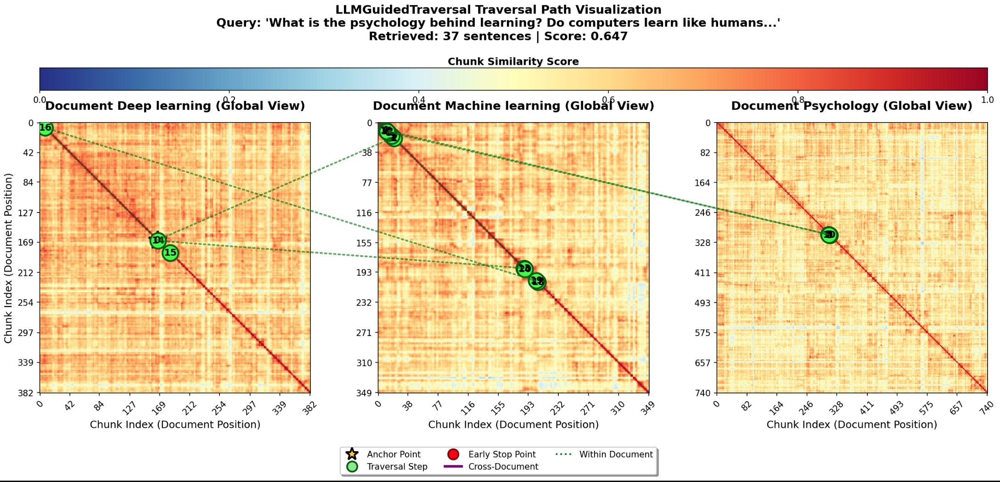
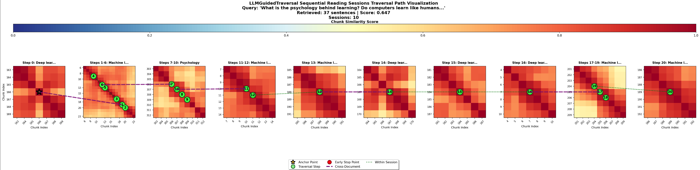
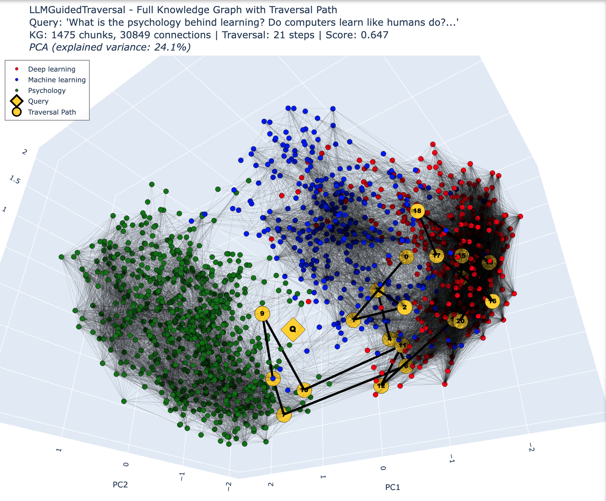
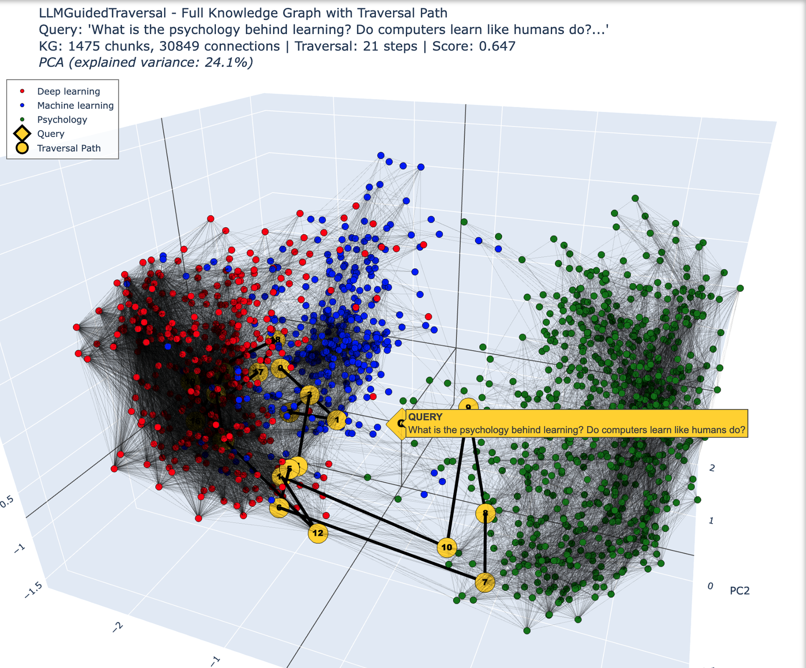
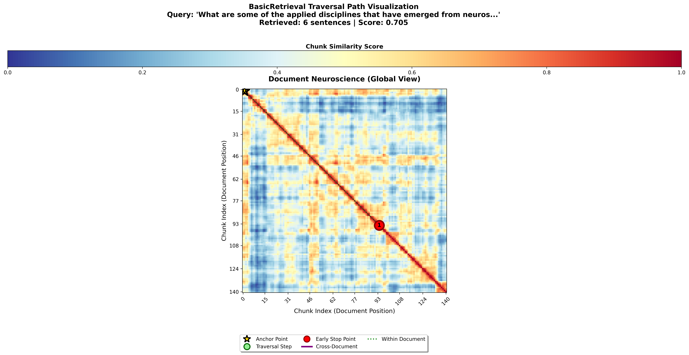
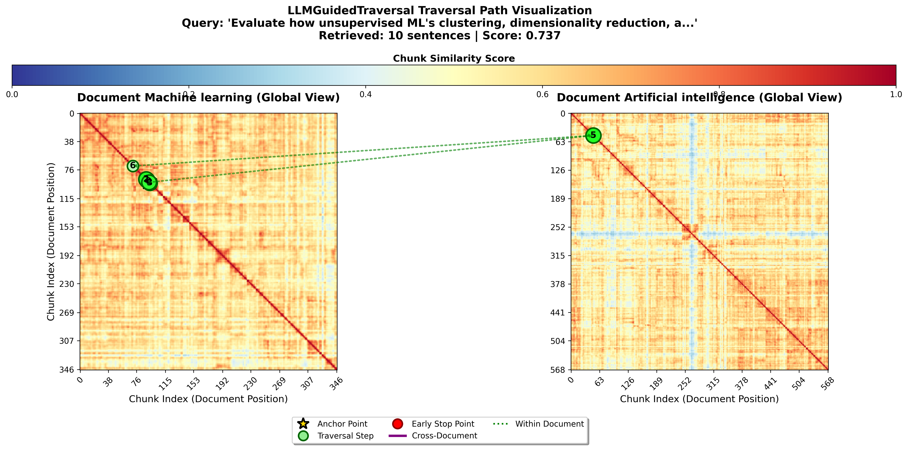
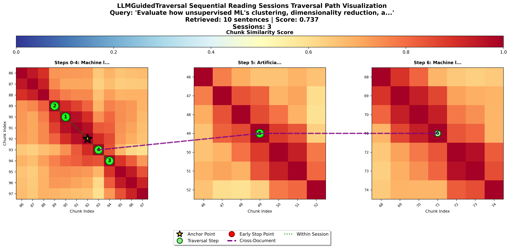
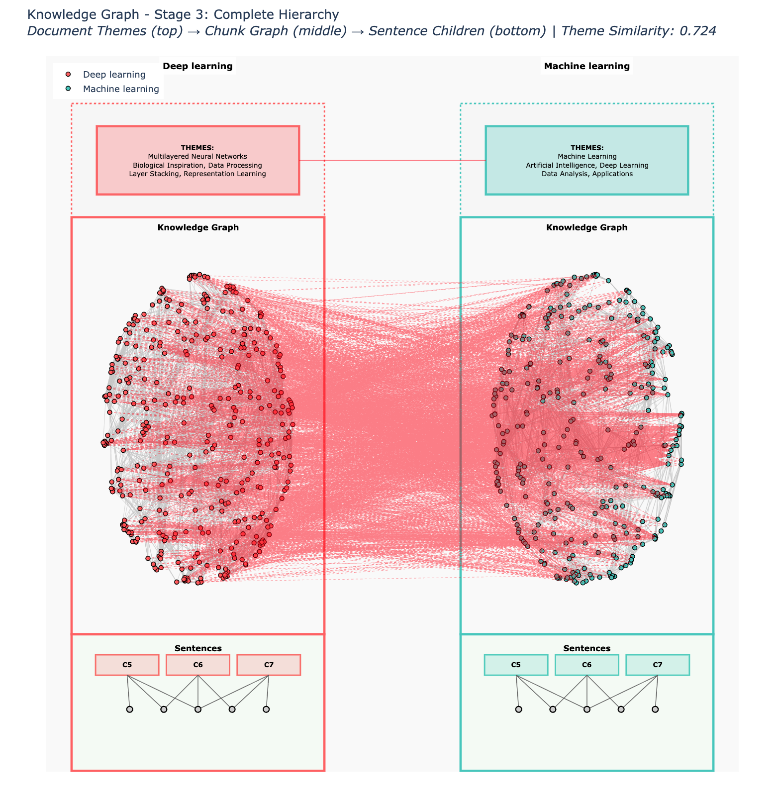
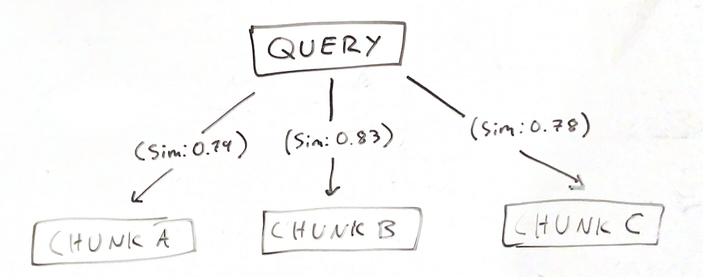

<h1 align="center">Novel Knowledge Graph Traversal Algorithms for Semantic Retrieval Augmented Generation Systems</h1>

---


---

<h1 align="center">Abstract</h1>
<div align="center">Semantic retrieval augmented generation (RAG) systems are designed to provide large language models (LLMs) with the necessary context to answer user queries precisely and accurately from a database or knowledge graph. However, the innate challenge with traditional RAG systems is their dependence on fine-tuned, raw text matching via a vector store based on the user's query. This research proposes novel traversal algorithms that meaningfully move through knowledge bases with the goal of extracting highly relevant and precise information for user queries. These traversal algorithms provide the foundational bedrock in the pursuit of accurate semantic RAG systems and can be easily built upon or fine-tuned depending on use case. </div>

---
<div align="center">
  
  
</div>

---

<h1 align="center">Foreword</h1>

This `README.md` contains a concise publication of the research discovered in this repository. For a thorough, guided demonstration with interactive elements (algorithm testing, knowledge graph visualizations like the ones above), please view the Jupyter notebook in the root of this repository. It is intended to be run locally via a Python `venv` due to dependencies.

To run the notebook, first ensure you have Python 3.12 and `ollama` installed, then run:

```commandline
git clone https://github.com/Leviathanium/semantic-rag-chunking-research
cd semantic-rag-chunking-research
python3.12 -m venv .venv 
source .venv/bin/activate
pip install -r requirements.txt
jupyter notebook chunking_research_demonstration.ipynb
```

Additionally, if you are interested in running the full pipeline, you may do so. First, set your environment variables in the `.env` and `.env.local`.

```commandline
# OpenAI Configuration
OPENAI_API_KEY=openai-api-key

# Ollama Configuration
OLLAMA_BASE_URL=http://localhost:11434

# Anthropic Configuration
ANTHROPIC_API_KEY=anthropic-api-key

# OpenRouter Configuration
OPENROUTER_API_KEY=openrouter-api-key

# DeepEval Platform Configuration
CONFIDENT_AI_API_KEY=deepeval-api-key
```

Then take a look at the `config.yaml` which holds the configuration settings of the entire repository. Upon publication, it will be configured to test *all seven algorithms* on a single DeepEval golden. To do this, run:

```commandline
python benchmark.py --verbose
```

Lastly, two notes. First, reranking code exists in the repository but has been depreciated. The final results from evaluation contained *no reranking*. Additionally, many ideas here build on other publications such as Microsoft's GraphRAG and Alibaba's KG-Retriever algorithm. They are recommended reads and will be cited at the end of this publication.

<h1 align="center">Knowledge Graph Architecture</h1>

To maximize traversal quality, a novel knowledge graph architecture is necessary. This section will outline the architecture behind this hierarchical knowledge graph structure.

First, assuming we have a series of documents, we must begin by chunking them. Many strategies for semantic chunking have been proposed, but for this knowledge graph, it is absolutely crucial that we have a degree of consistent overlap between chunk boundaries.  This provides a "smoothness" between chunks.

To understand the knowledge graph structure, take a look at the following visualization of a *similarity matrix*:

---



*<h4 align="center">Figure A: Similarity matrix of the "Neuroscience" document on Wikipedia, with all possible 3-sentence pairwise cosine similarity comparisons visualized. Red indicates high similarity, blue, indicates low similarity.</h4>*

---

A *similarity matrix* is a `numpy` array that contains all possible cosine similarity comparisons between the embeddings of every single chunk within a document. For this research, `mixedbread-ai/mxbai-embed-large-v1` was used, as it is a high 1024-dimensional model and has been used in other publications.

This visualization shows the "Neuroscience" article on Wikipedia and it is very clear where larger, thematic groupings are throughout the document symmetrically along the diagonal, where every chunk is completely red due to being compared directly to itself. It is very apparent in the visualization that sentences 1 through 15 are very dissimilar to the rest of the document, as evidenced by the deep blue hue.

Similarity matrices are best indexed at the sentence level (one entry per sentence in the document). This means that for the best traversal results, we use a *three sentence sliding window* that moves through the document 1 sentence at a time. So every entry in the array is actually an embedding comparison for *three sentences*. Additionally, to minimize memory usage, we can choose to *sparsely store our top comparisons for each position*, typically only the top 10 chunk comparisons for each chunk. This significantly reduces memory usage by multiple factors and is crucial for larger knowledge graphs.

To create our knowledge graph edges, we simply take our top intra-document cosine similarities (denoted `top_k`) and our top inter-document cosine simliarities (denoted `top_x`) as graph edges. This allows us to effectively "connect" sparse similariy matrices together.

---


*<h4 align="center">Figure B: Global raversal path an LLM took between the "Machine learning" and "Artificial intelligece" articles on Wikipedia. Traversal begins with "Machine learning," then at step 5, briefly hops to "Artificial intelligence" before hopping back.</h4>*

---


*<h4 align="center">Figure C: Sequential traversal path from Figure B. The LLM found sentences ~89 to ~94 to be highly relevant to the query, then jumped to "Artificial Intelligence" before immediately returning back to the previous document.</h4>*

---

### Adding Hierarchical Properties

Building off Microsoft's GraphRAG publication, we want to add *hierarchical properties* to our graph nodes. At this point the chunk level has been established, but we still want to have a thematic/document level for broader themes, as well as the sentence level for granular comparisons. We can implement sentence-level nodes by *only storing them as children to the parent windows they came from.* This allows us to reference sentences within our knowledge graph for sentence-level accuracy, while minimizing unnecessary noise, as sentence nodes in the graph will only connect to their respective parent chunks.

Finally, for hierarchical propertiees, `ragas` and other libraries like it use tools like NER (Named Entity Recognition) to extract named entities and themes. To keep things simple and lightweight, we take the first 500 words of a Wikipedia document, feed this summary to an LLM, then have it generate *5 unique themes* from the summary. These 5 themes then get passed down to *all chunk and sentence nodes* inside that particular document. We can also take those five themes as a list, embed them as one chunk, then compare all thematic chunk similarities between each other to then, create another bridge between the most similar documents by theme, denoted by a `top_t`.

The final result is a *lightweight knowledge graph* that is designed to be traversed. 

---



*<h4 align="center">Figure D: Multi-layer knowledge graph architecture. At the document level, themes are extracted for their similarity and all chunk/sentence nodes inherit these themes. At the chunk level, we sparsely store intrachunk and interchunk cosine similarity connections between all documents. At the sentence level, each sentence is stored as a child to the parent chunk, and sentence are only compared to other sentences in the same chunk, and to the query, to keep the knowledge graph lightweight.</h4>*

---

https://github.com/user-attachments/assets/eb2d7433-b884-4c9d-91bd-04b4a9169fc0

*<h4 align="center">Figure E: Plotly visualization generated of a knowledge graph of three Wikipedia documents with an LLM traversal path through the graph. You may explore this run by downloading the Plotly HTML graph [here.](https://github.com/Leviathanium/semantic-rag-chunking-research/releases/download/html/KG_PLOTLY.html)</h4>*

---

https://github.com/user-attachments/assets/b6f7539b-8fc6-4cb0-89aa-aac32dc02c0c

*<h4 align="center">Figure F: Closer inspection of the LLM traversal path through the knowledge graph to retrieve relevant context to the query.</h4>*

---

<h1 align="center">Algorithms</h1>

With the knowledge graph established, we can begin exploring traversal methods. After embedding a user query, instead of attempting mass retrieval via cosine similarity matching like traditional RAG systems, we want to find a *single chunk* that we can "anchor" to. This "anchor" chunk is, in all algorithms, the most similar chunk to the query by cosine similarity. In other words, instead of retrieving lots of chunks via matching and then using a reranking model, we will identify *a single chunk* to anchor to, then begin traversal. Interestingly, in a related paper: *[KG-Retriever: Efficient Knowledge Indexing for Retrieval-Augmented Large Language Models](https://arxiv.org/abs/2412.05547)*, these researchers use the term "seed" chunk rather than "anchor."

Once we've identified our anchor chunk, we need an algorithmic approach to retrieving the most accurate and relevant information to user's query. Here are the most important constraints for our algorithms:

1. During traversal, we need to look at all possible candidate chunks to traverse to in our sparse knowledge graph. Then decide which to traverse to based on a chosen measurement of cosine similarity. This decision should come a particular objective. The objectives that we will explore include direct query similarity, high knowledge graph similarity to candidiate chunks, and weighted average between prospective chunks.
2. When choosing which chunk candidate to traverse to and extract sentences from, we can assume that the prospective chunk candidates are already highly connected. This means that as long as we choose to extract the *most similar and/or relevant chunk at each step*, we will then have the opportunity to choose a prospective chunk that might have only ranked second or third at the previous step. It is very unlikely that we will outright ignore or outright reject relevant information so long as we continuously prioritize the most relevant chunk at each step, save for algorithmic fine-tuning.
3. We need to determine when our algorithms should *stop traversing*. This is crucial, otherwise we'll extract way too much information, reducing relevancy and conciseness. For many of the algorithms in this research (except for LLM guided traversal), the `max_sentences` is set to a fixed value between 10 and 15. This is to match the synthetic dataset context grouping algorithms, which group between 10 and 15 sentences to generate synthetic questions from for benchmarking (more on that in *Benchmarking*). In cases where one might attempt deep research, this could be expanded upon significantly but for research purposes, we will keep this value static and reasonable.
4. The information we extract must be *faithful*, meaning as factually accurate as possible. This is crucial, because semantically relevant content might be within the context of an opinionated section of text, like a quote from a scientist or philosopher. This means we need to separate out facts from opinions, and if we extract any opinions, they need to be properly contextualized *as opinions, not facts*. Our three-sentence sliding window chunking strategy helps with this significantly because groups of opinions will have a higher probability of semantically separating themselves from neighboring contexts. A quote from a scientist within the context of a particular subject will gently offset the similarity in the direction of the individual being quoted, which increases the probability that if we need to extract part of a quote, we will accurately extract the *entire quote* to preserve faithfulness.
5. The algorithms must be *fast*, save for the LLM guided traversal, as it could be argued that this algorithm's speed aligns with it's chain of thought. We do this by effectively "adding" the user's query directly into the knowledge graph, by doing vectorized calculations against all embeddings in the knowledge graph the same way one would do in a traditional RAG system. The core difference is maintaining the cached similarities during traversal so that we don't have to repeatedly recalculate similarities to the query as we traverse.

There are **seven** total algorithms in this repository that can be used for retrieval. Each will be explained in its own section:

1. `basic_retrieval`
2. `query_traversal`
3. `kg_traversal`
4. `triangulation_average`
5. `triangulation_geometric`
6. `triangulation_fulldim`
7. `llm-guided-traversal`

---
## 1. `basic_retrieval`

*Basic semantic RAG algorithm. Contains no traversal. Used as a control.*



First, embed the user's query.

$$\vec{q} = \text{embed}(\text{query})$$

Lookup the most semantically similar chunks in the knowledge graph directly based on cosine similarity.

$$\text{sim}(\vec{q}, \vec{c}_i) = \frac{\vec{q} \cdot \vec{c}_i}{\|\vec{q}\| \|\vec{c}_i\|}$$

Continue selecting the cached top chunks until `max_sentences`, stopping early once individual sentence quality beats the next chunk option (after at least five sentences are gathered).

$$\text{Stop when: } |S| \geq \text{limit} \text{ or } \big(|S| \geq 5 \land \max_{s \in S_{\text{extracted}}} \text{sim}(\vec{q}, \vec{s}) > \text{sim}(\vec{q}, \vec{c}_{\text{next}})\big)$$

---

## 2. `query_traversal`

*Query-guided graph traversal that always prioritizes similarity to the original query.*


Embed the user's query and find the ***most similar chunk node in the graph to the query.*** This is called the *anchor chunk.*

$$\vec{q} = \text{embed}(\text{query}), \quad c_0 = \arg\max_{c_i} \text{sim}(\vec{q}, \vec{c}_i)$$

Starting from the anchor chunk's top inter-document and top intra-document connections, at each hop, find the next node (chunk or sentence) most similar to the query.

$$n_{t+1} = \arg\max_{n \in \text{neighbors}(c_t)} \text{sim}(\vec{q}, \vec{n})$$

Extract all sentences from each visited chunk (including the anchor chunk). Continue traversing to chunks with highest query similarity.

$$c_{t+1} = \arg\max_{c \in C_{\text{unvisited}}} \text{sim}(\vec{q}, \vec{c})$$

Chunks are not revisited; newly extracted sentences are deduplicated against what has already been gathered.

Stop when `max_sentences` reached or, once at least eight sentences have been collected, when the best extracted sentence exceeds the best available chunk (early stopping).

$$\max_{s \in S_{\text{extracted}}} \text{sim}(\vec{q}, \vec{s}) > \max_{c \in C_{\text{available}}} \text{sim}(\vec{q}, \vec{c}) \implies \text{stop}$$

---

## 3. `kg_traversal`

*Chunk-centric graph traversal that follows local similarity paths (not query similarity), with a focus on greater graph exploration.*


Similar to the `query_traversal` algorithm, start at the anchor chunk.

$$c_0 = \arg\max_{c_i} \text{sim}(\vec{q}, \vec{c}_i), \quad S_0 = \text{sentences}(c_0)$$

Unlike the `query_traveral` algorithm, starting from the anchor chunk's `top_x` and `top_k` connections, at each hop, find the next chunk ***most similar to the node that we are currently at in the graph.***

$$c_{t+1} = \arg\max_{c \in \text{neighbors}(c_t)} \text{sim}(\vec{c}_t, \vec{c})$$

To encourage exploration and prevent too much read-through, prevent sentence overlap by skipping chunks containing already-extracted sentences, and traversal only considers chunk nodes (sentence nodes are ignored).

$$c \notin C_{\text{candidates}} \text{ if } \text{sentences}(c) \cap S_{\text{extracted}} \neq \emptyset$$

Stop when next chunk similarity ≤ previous hop similarity (exploration-potential early stopping), or at `max_sentences`.

$$\text{sim}(\vec{c}_t, \vec{c}_{t+1}) \leq \text{sim}(\vec{c}_{t-1}, \vec{c}_t) \implies \text{stop}$$

---

## 4. `triangulation_average`

*Averages cosine similarity scores between the query, current chunk, and prospective chunk/sentence nodes at each step. Creates a balanced averaged traversal that considers both the query and prospective chunks.* When a sentence belongs to a different chunk, sentence-to-chunk similarity is approximated from cached scores so the averaged triangle score stays comparable.


Embed query and start at anchor chunk.

$$\vec{q} = \text{embed}(\text{query}), \quad c_0 = \arg\max_{c_i} \text{sim}(\vec{q}, \vec{c}_i)$$

At each traversal step, identify all graph edges between the current chunk, query, and prospective chunks. Consider these edges as triangles.

$$\text{avg}(\vec{q}, \vec{c}_t, \vec{c}_{\text{candidate}}) = \frac{\text{sim}(\vec{q}, \vec{c}_t) + \text{sim}(\vec{q}, \vec{c}_{\text{candidate}}) + \text{sim}(\vec{c}_t, \vec{c}_{\text{candidate}})}{3}$$

Stop when best extracted sentence average exceeds best available chunk average (evaluated once at least eight sentences anchor the check), or when we hit `max_sentences`.

$$n_{t+1} = \arg\max_{n \in \text{neighbors}(c_t)} \text{avg}(\vec{q}, \vec{c}_t, \vec{n})$$

When a sentence belongs to a different chunk, sentence-to-chunk similarity is approximated from cached scores so the averaged triangle score stays comparable.

$$\max_{s \in S} \text{avg}(\vec{q}, \vec{c}_t, \vec{s}) > \max_{c \in C} \text{avg}(\vec{q}, \vec{c}_t, \vec{c})$$

---

## 5. `triangulation_geometric_3d`

*Geometric triangulation of prospective chunk centroids using PCA-reduced 3D embeddings.*


Reduce all embeddings to 3D using PCA.

$$\vec{q}_{3D}, \vec{c}_{i,3D} = \text{PCA}_{1024 \to 3}(\vec{q}, \{\vec{c}_i\})$$

Similarly to `triangulation_average`, at each traversal step, identify all graph edges between the current chunk, query, and prospective chunks. This time, find the `triangle centroid` of each created triangle.

$$\vec{\text{centroid}} = \frac{\vec{q}_{3D} + \vec{c}_{t,3D} + \vec{n}_{3D}}{3}$$

Traverse to the node with its centroid closest to query (minimal Euclidean distance).

$$n_{t+1} = \arg\min_{n \in \text{neighbors}(c_t)} \|\vec{\text{centroid}}(\vec{q}, \vec{c}_t, \vec{n}) - \vec{q}_{3D}\|_2$$

---

## 6. `triangulation_fulldim`

Geometric triangulation in *full* embedding space.

Work directly with full embeddings instead of PCA 3D reduction.

$$\vec{q}, \vec{c}_i \in \mathbb{R}^{d}\quad(\text{dimension auto-detected per knowledge graph, default }d=1024)$$

Similarly to the other triangulation algorithms, identify triangles. But this time, in full embedding dimensional space.

$$\vec{\text{centroid}}_{1024D} = \frac{\vec{q} + \vec{c}_t + \vec{n}}{3}$$

Select node with centroid closest to query in full-dimensional Euclidean space.

$$n_{t+1} = \arg\min_{n \in \text{neighbors}(c_t)} \|\vec{\text{centroid}}(\vec{q}, \vec{c}_t, \vec{n}) - \vec{q}\|_2$$

Most mathematically rigorous approach, preserves all embedding information.

$$\text{Edge lengths: } d(\vec{q}, \vec{c}) = \|\vec{q} - \vec{c}\|_2$$

---

## 7. `llm-guided-traversal`

Modified version of `query_traversal` but uses a lightweight LLM instead. Trades speed and cost for accuracy.


Embed query and find anchor chunk (same as other algorithms).

$$\vec{q} = \text{embed}(\text{query}), \quad c_0 = \arg\max_{c_i} \text{sim}(\vec{q}, \vec{c}_i)$$

At each hop, get `top_k` and `top_x` potential chunks based on query similarity.

$$C_{\text{candidates}} = \text{top-k}\{c \in \text{neighbors}(c_t) \mid \text{sim}(\vec{q}, \vec{c})\}$$

At each hop, the LLM receives this prompt:

```
You are a knowledge graph traversal agent. Your goal: find relevant content to answer the query.

QUERY: {user's question}

ALREADY EXTRACTED ({n} sentences):
{summary of first 5 sentences extracted so far...}

CANDIDATE CHUNKS (pick ONE or STOP):
1. [chunk_id_1] (similarity: 0.85)
   Preview: {first 200 chars of chunk 1}...

2. [chunk_id_2] (similarity: 0.78)
   Preview: {first 200 chars of chunk 2}...

3. [chunk_id_3] (similarity: 0.72)
   Preview: {first 200 chars of chunk 3}...

4. [chunk_id_4] (similarity: 0.69)
   Preview: {first 200 chars of chunk 4}...

5. [chunk_id_5] (similarity: 0.65)
   Preview: {first 200 chars of chunk 5}...

INSTRUCTIONS:
- Choose the chunk number (1-5) that seems most relevant to answering the query
- If you believe we have enough information to answer the query, respond with "stop"
- Consider both what we've already extracted and what new information each candidate provides
- Respond ONLY with a JSON object in this exact format:

{"choice": <number 1-5 OR "stop">, "reasoning": "brief explanation"}

Your response:
```
---

Send the user's query, the currently extracted context, and previews of potential chunks to LLM. LLM chooses next chunk or stops.

If the LLM response is invalid, fall back to the highest query similarity candidate to keep traversal moving.

$$c_{t+1} = \text{LLM}(\text{query}, S_{\text{extracted}}, C_{\text{candidates}})$$

LLM decides when to stop based on semantic reasoning (not just similarity).

$$\text{LLM decides: continue or stop based on context sufficiency}$$

---

<h1 align="center">Evaluation</h1>

Benchmarking RAG systems can be done via a variety of different tools and libraries but it is primarily done via a series of universal metrics:

- Precision: How relevant the retrieved chunks are for answering the question.
- Recall: Whether all of the necessary info was retrieved to answer the question.
- Faithfulness: How grounded in fact the generated answer and retrieved contexts are.
- Answer Relevance: How relevant the geenerated answer was at actually answering the question.

These metrics are tracked using libraries like `ragas` and `deepeval`. After lengthy testing, `deepeval` was chosen for benchmarking and evaluation due to its flexibility and compatibility. To produce accurate and fair evaluation results, many variables and parameters were created with the express goal of optimizing semantic traversal, both for synthetic dataset generation and for retrieval.

It is important to consider that the primary objective during benchmarking was to *maximize both precision and recall*. Retrieved context should be relevant, but we need to be careful not to retrieve too much or too little. These scores are designed to demonstrate this balance. Additionally, we are running a controlled `basic_rag` to compare against that has been fine-tuned for this use case. Outperforming the `basic_rag` provides a baseline for validating the efficacy of these algorithms for other, broader use cases.
## Synthetic Datasets

DeepEval supports *synthetic dataset generation*. This involves a process of systematically grouping chunks of text and sending them to DeepEval to generate a question using an LLM of choice. Additionally, DeepEval uses a complex question-generation process called *evolution*, where it will generate a question, then recursively modify it according to a particular chain of thought (reasoning, multicontext, etc.)

Rather than random context grouping, a series of custom context grouping algorithms were created to group contexts in a way that would require more lengthy, meaningful semantic traversal. Here is the list of context grouping algorithms created for dataset generation:

---
### `intra_document`

Starting at a random chunk, traverse to the most similar chunk to the current chunk in the *current document* that ***does not contain a sentence we've already seen.*** This allows for a little bit more exploration. 

```
context_strategies:
  intra_document:
    enabled: true
    weight: 0.33
    max_sentences: 10
    description: "Within-document exploratory context grouping."
```

---
### `theme_based` (used for the 20 question dataset)

Starting at a random chunk, only consider all chunks connected from different documents. Then look at each chunk's inherited global themes, as well as the raw similarity between the current chunk's themes and these candite chunk themes. Then, traverse to the chunk that has the *highest similar thematic overlap*. Doing this at each step results in *only* cross-document hops that are thematically similar, but may not necessarily be semantically similar, resulting in added complexity.

```
context_strategies:
  theme_based:
    enabled: true
    weight: 0.33
    max_sentences: 10
    fallback_to_inter_document: true
    description: "Cross-document thematic context grouping."
```

---
### `sequential_multi_hop` (used for the 50 question dataset)

Starting at a random chunk, "read" forwards or backwards inside the current document (whichever is most similar). Then after reaching 5 sentences, do a `theme_based` hop to the most thematically similar chunk in a different document. Then, "read" forwards or backwards again. We do this so that we don't **just** hop between documents during retrieval; we actually want to attempt to get our algorithms to "read" a little bit during retrieval, and this context grouping algorithm is designed to demonstrate that once we attempt retrieval.

```
context_strategies:
  sequential_multi_hop:
    enabled: true
    weight: 0.33
    num_reading_hops: 3
    num_paragraph_sentences: 5
    num_cross_doc_hops: 3
    description: "Cross-document thematic reading simulation: 3 docs × 5 sentences = 15-sentence narratives"
```

---
### `deepeval_native`

Basic context grouping. Uses a few random or sequential chunks, basic sentence deduplication, and `deepeval`'s quality filtration. Useable as a baseline but isn't very robust.

```
context_strategies:
  deepeval_native:
    enabled: true
    weight: 0.2
    max_sentences: 10
    extraction_mode: "random"
    chunks_per_group: 3
    ensure_document_diversity: true
    description: "Simple random/sequential extraction with DeepEval FiltrationConfig quality filtering - no semantic traversal"
```

---

## Knowledge Graph and Evolved Datasets

There are *two* synthetic datasets created, as well as a small knowledge graph from Wikipedia for retrieval. The datasets are available in the `datasets` directory:

- `20q-themes-gpt4omini-reasoning`: For this evaluation, 20 questions were generated using `theme_based` context grouping, with `max_sentences` set to 10, resulting in 3 hops each time. The question, expected output, answer, and critic generation were done using `gpt-4o-mini` for both dataset generation and retrieval. Every question was evolved a single time using DeepEval's "reasoning" evolution type.


- `50q-seq-multihop-gpt-4o-reasoning-comparative-multicontext`: For this evaluation, 50 questions were generated using `sequential_multi_hop` context grouping, with `max_sentences` set to 15, resulting in 3 hops of 5-sentence reading groups. Questions were generated using `gpt-4o`, and expected output, answer, and critic generation were done using `gpt-5-nano`. Every question was evolved a single time, with the following distribution:

  - Reasoning: 40% distribution
  - Multicontext: 40% distribution
  - Comparative: 20% distribution


For the knowledge graph, a `WikiEngine()` was created to extract and clean text from articles of particular topics. The two chosen were:

- "Machine Learning" 
- "Artificial Intelligence"

`articles_per_topic` was set to 5, resulting in 10 total documents in the knowledge graph. For theme extraction, `llama 3.1: 8b` was used to extract document themes to be inherited by all chunk/sentence nodes in each respective document. `mixedbread-ai/mxbai-embed-large-v1` was used for embeddings. Named Entity Recognition (NER) processing was disabled, as it was difficult to make use of compared to raw theme extraction, and the knowledge graph specifically relies on cosine simliarity edges rather than raw entity overlap. Quality scoring was also disabled.

---

<h1 align="center">Benchmarking Results</h1>

$$\Large\text{20qa-themes-gpt4omini-reasoning}$$

| Algorithm | Precision | Recall | Answer Relevancy | Faithfulness | Test Cases |
|:---|:---:|:---:|:---:|:---:|:---:|
| `basic_retrieval` | 0.87 | 0.74 | 0.91 | 0.93 | 16/20 |
| `query_traversal` | 0.83 | 0.83 | 0.91 | 1.00 | 16/20 |
| `kg_traversal` | 0.73 | 0.72 | 0.98 | 0.92 | 15/20 |
| `triangulation_average` | 0.84 | 0.77 | 0.96 | 1.00 | 16/20 |
| `triangulation_geometric_3d` | 0.86 | 0.77 | 0.96 | 1.00 | 16/20 |
| `triangulation_fulldim` | 0.90 | 0.78 | 0.95 | 0.99 | 17/20 |
| `llm_guided_traversal` | 0.88 | 0.82 | 0.95 | 1.00 | 17/20 |

In this evaluation, `llm_guided_traversal` and `triangulation_fulldim` passed the highest number of test cases, considering this context grouping algorithm was designed to be more challenging (less context between hops compared to `sequential_multi_hop`). `triangulation_fulldim` had the highest precision, and `query_traversal` performed admirably at an evenly balanced 0.83 for both precision and recall. Most importantly, most algorithms outperformed `basic_retrieval` in one or more metrics, which was the objective of the research.  

---
$$\Large\text{50qa-seq-multihop-gpt4o-reasoning-comparative-multicontext}$$

| Algorithm | Precision | Recall | Answer Relevancy | Faithfulness | Test Cases |
|:---|:---:|:---:|:---:|:---:|:---:|
| `basic_retrieval` | 0.93 | 0.88 | 0.99 | 0.99 | 48/50 |
| `query_traversal` | 0.91 | 0.91 | 0.98 | 1.00 | 50/50 |
| `kg_traversal` | 0.93 | 0.87 | 0.99 | 0.99 | 49/50 |
| `triangulation_average` | 0.92 | 0.87 | 0.98 | 0.99 | 49/50 |
| `triangulation_geometric_3d` | 0.93 | 0.85 | 0.98 | 1.00 | 48/50 |
| `triangulation_fulldim` | 0.93 | 0.87 | 1.00 | 0.97 | 47/50 |
| `llm_guided_traversal` | 0.91 | 0.94 | 0.99 | 0.99 | 49/50 |

This evaluation was significantly more robust. Immediately, `query_traversal` proves a 100% winrate on the test cases, failing zero of them. This is excellent to see, as the express purpose of this algorithm is to compare itself against the query at each step of traversal. It also achieved a balanced 0.91 for both precision and recall, slightly losing against `basic_retrieval` on precision, but beating it on recall, which is exactly what we would expect to see.

`llm_guided_traversal` also performed extremely well with the highest recall, only failing a single test case. Given that `llm_guided_traversal` is actually just a gently modified version of the `query_traversal` algorithm, it is excellent to see both performing similarly, and just ahead of the `basic_retrieval`.

All three triangulation algorithms did excellently with precision, but fell behind in recall compared to the `basic_retrieval`. This implies that these algorithms were good at pulling highly relevant information, but may have struggled more with pulling *all the necessary context to answer the query*. With more fine-tuning, one might be able to pull better performance out of these three algorithms depending on use case. 

`kg_traversal` functioned across both evaluations as a benchmark for the lower percentile for all metrics. This is due to its agnosticism towards the original query; it only traverses based on relevancy to the current chunk. This explains the significant underperformance in `20qa-themes-gpt4omini-reasoning`, particularly in faithfulness; it frequently retrieved slightly less factually true information (pulling opinions rather than facts) when prioritizing raw knowledge graph similarity. This is also visible in its precision and recall scores across both tests. 

<h1 align="center">Conclusion</h1>

Semantic RAG systems and knowledge graph architecture will continue to evolve as research in both areas emerges. This research is designed to be a step in that direction. There are still many areas of exploration that one may continue to go down, if they so choose. For example:

- Implementing look-ahead to each algorithm to determine the best path several steps before traversing.
- Utilizing a significantly larger knowledge graph, exceeding 500-1000 documents in size.
- Fine-tuning traversal algorithms for deep research, utilizing LLM recursive deep research methods to explore topics in-depth through sub-agents

These algorithms are available for use via an open source license: teams and organizations may fork this repository and continue to research best practices and implementations for these systems using all code in this repository. I ask that you cite this repository as the foundation for any continued research in the field.

Sources:

*KG-Retriever: Efficient Knowledge Indexing for Retrieval-Augmented Large Language Models*

*Microsoft GraphRAG*